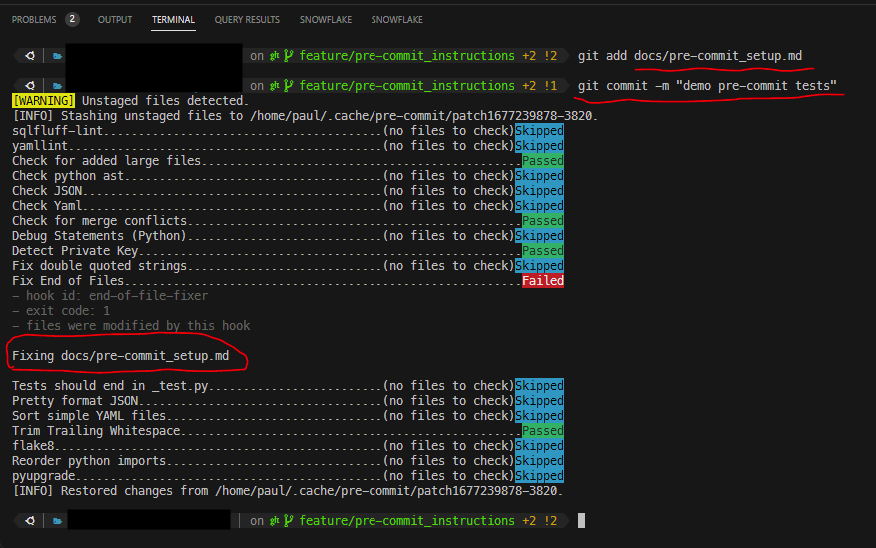

# `pre-commit` Installation Instructions

## Download `pre-commit`

Download `pre-commit` by typing `pip3 install pre-commit`.

---

## Install `pre-commit`

To install and use `pre-commit`, do the following:

1. In the terminal, navigate to the root of the git repo
2. Next, type `pre-commit install`

and you're done!

---

## Great, so what does `pre-commit` do

Let's say you now want to add and commit a new file you've created to Git. So you type:

```bash
    git add <my_file>
    git commit -m "my message"
```

However, when you do then commit your changes, a series of pre-commit tests are run, as shown below:



* As you can see, a series of pre-commit tests have been triggered - including a test that fails.
* The goal of these tests is to capture quality issues quickly on your machine, prior to pushing your changes to the remote git repo.
* For information on all of the tests that are triggered, see [Summary of `pre-commit` Tests](pre-commit_tests.md).

### '`Fixing <filename>`'

* The other thing you'll notice in the screenshot above, is that the test called `Fix End of Files` actually *fixed* the file containing issues on your behalf.
* Because it has done it on your behalf, you will now need to once again add and commit this newly changed file to git.
